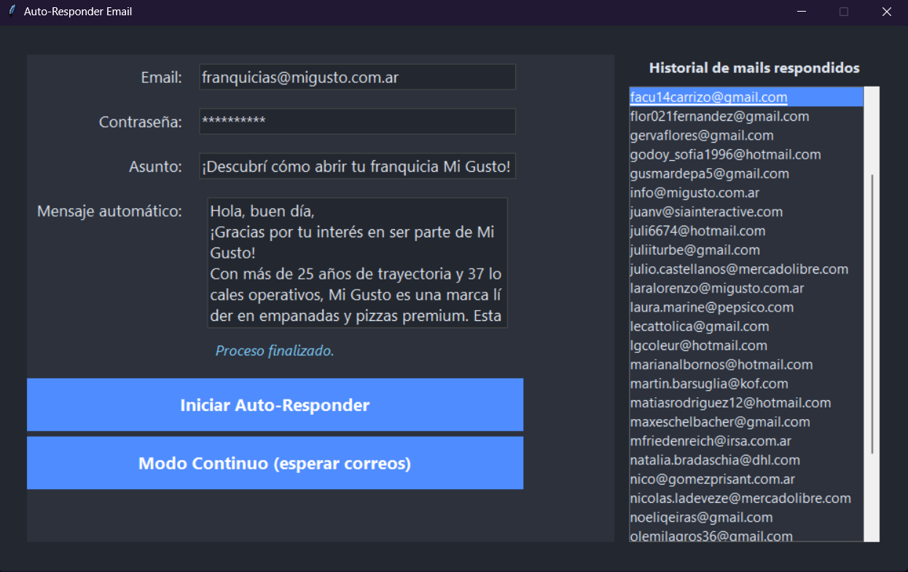

# ✉️ Auto-Mail Answers

  <b>Automatización inteligente y eficiente para la gestión de respuestas por correo electrónico</b>

  
  
  
  

  

---

## 📌 Descripción General

**Auto-Mail Answers** es una herramienta de escritorio moderna diseñada para optimizar la atención por correo electrónico. Permite responder de manera automática a correos entrantes no leídos de forma rápida, segura e interactiva a través de una interfaz visual intuitiva en modo oscuro.

Ideal para empresas, emprendimientos y áreas de soporte que requieren dar acuse de recibo inmediato a sus clientes sin intervención manual continua.

---

## ✨ Características Principales

- 🎨 **Interfaz Gráfica Moderna**: Diseño limpio y profesional con tema oscuro (*Dark Mode*) que facilita la navegación.
- ⚡ **Respuesta Automática Inmediata**: Procesa correos pendientes sin leer con un solo clic.
- 🔄 **Monitoreo Continuo**: Ejecución en segundo plano para escuchar y responder nuevos emails en tiempo real.
- 🛡️ **Prevención de Duplicados**: Sistema de registro e historial que garantiza responder únicamente una vez a cada remitente/mensaje.
- ⏱️ **Procesamiento Multihilo**: Ejecución asíncrona mediante *threading* para mantener la interfaz fluida en todo momento.
- 💾 **Persistencia Automática**: Conservación de parámetros y preferencias al cerrar la aplicación.

---

## 🎯 Modo de Uso

1. **Ingreso de Credenciales y Plantilla**:
   - Ingrese el correo electrónico y la contraseña correspondiente.
   - Defina el **Asunto** y el **Cuerpo del Mensaje** que se enviará automáticamente.

2. **Selección del Modo de Operación**:
   - **Iniciar**: Realiza una única comprobación y responde a todos los correos no leídos actuales.
   - **Modo Continuo**: Activa el monitoreo constante para enviar respuestas a medida que ingresan nuevos mensajes.

3. **Supervisión de Estado**:
   - Visualice en tiempo real los registros (*logs*) y el estado del envío directamente desde el panel principal.

---

## 💡 Aspectos Destacados

> [!NOTE]  
> **Gestión Inteligente de Lectura**  
> El sistema marca automáticamente los mensajes procesados como leídos y registra el ID en el historial para evitar reenvíos accidentales.

> [!TIP]  
> **Ejecución en Segundo Plano**  
> Gracias a su arquitectura multihilo, la interfaz permanece 100% responsiva sin congelarse durante los procesos de consulta o envío masivo.

---

## 📄 Licencia

Este proyecto está destinado a uso corporativo e interno. Todos los derechos reservados.

